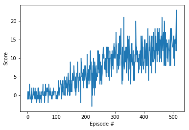

# udacity-navigation
## Project environment details
This repository solves the first project assignment of Udacity's Deep Reinforcement Learning Nanodegree. 

Included is a self-learning agent that learns to navigate in a virtual world based on the Unity engine to collect yellow bananas while avoiding blue bananas. Every yellow banana collected rewards one point to the agent while every blue banana costs one point.

The environment's state gives the agent a 6x6 pixel view on its surroundings. Additionally, one input is dedicated to the agent's velocity, adding up to 37 state parameters. 

Based on this perception the agent may choose one of four actions, e.g. turn left or right and move forward or backward.

The challenge is considered solved if the agent manages to collect more than 13 points in average over 100 consecutive episodes.

## Getting started

The project was solved using Udacity's prepared cloud servers. For runtime requirements please refer to Navigation.ipynb

Required files for training and running the agent are model.py, dqn_agent.py and Navigation.ipynb. Model.py includes the agent's neural network, dqn_agent.py consists of the agent's memory collection and training routine and solution.ipynb has this agent interact with the preset Unity world.

## Solution architecture
The agent uses the Double DQN approach with two duplicate neural networks consisting of three fully connected layers with 64 nodes each and RELU activation functions. The "local" networks' parameters are updated on every learning step while the "target" networks' parameters are softly nudged towards the "local" networks' parameter values with an adjustment factor of .001.

Batches of 64 next states chosen randomly from a buffer of 100,000 memorized experiences are passed through both networks and produce two sets of action values. While the local network's output is used to choose the preferred action based on maximum value, the target network's value for that action is discounted (gamma = .99) and added to memorized rewards to calculate current state values. These are compared against state values predicted by the local network and the loss is backpropagated through the local network. 

Local network parameters are then updated using Adam optimizer and a learning rate of .0005.  

## Results

The described approach achieved an average score of 13 points over the last 100 episodes after 513 episodes of training.

## Outlook

In order to improve the algorithm's performance, [prioritized experience replay](https://arxiv.org/abs/1511.05952) or [dueling DQN architecture](https://arxiv.org/abs/1511.06581) may be implemented.
